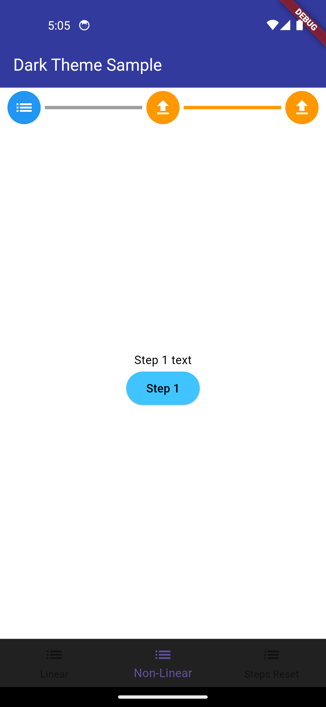

# sadja_progress_stepper

A customizable and scrollable progress stepper widget for Flutter applications.

## Features
- Supports both **linear** (sequential) and **non-linear** (free navigation) modes.
- Customizable step colors for **active**, **completed**, and **incomplete** steps.
- Supports **icons** for steps.
- Scrollable when steps exceed screen width.

## Installation
Add the following to your `pubspec.yaml`:
```yaml
dependencies:
  sadja_progress_stepper: ^1.0.0
```

Then, run:

```bash
flutter pub get
```

## Usage

```dart
import 'package:flutter/material.dart';
import 'package:sadja_progress_stepper/sadja_progress_stepper.dart';

void main() {
  runApp(MyApp());
}

class MyApp extends StatelessWidget {
  @override
  Widget build(BuildContext context) {
    return MaterialApp(
      home: Scaffold(
        appBar: AppBar(title: Text("Progress Stepper Example")),
        body: SadjaProgressStepper(
          steps: [
            StepItem(icon: Icon(Icons.looks_one), content: Text("Step 1")),
            StepItem(icon: Icon(Icons.looks_two), content: Text("Step 2")),
            StepItem(icon: Icon(Icons.looks_3), content: Text("Step 3")),
          ],
          activeStepColor: Colors.blue,
          completedStepColor: Colors.green,
          incompleteStepColor: Colors.grey,
          completedSteps: [0, 1],
          onStepTapped: (step) {
            print("Step $step tapped");
          },
        ),
      ),
    );
  }
}
```

## Example App

Check out the full example in the `example/` directory.

## Screenshots

## Screenshots

### Non Linear Stepper  





### Linear Stepper with steps reset 


## License

This package is released under the MIT License.